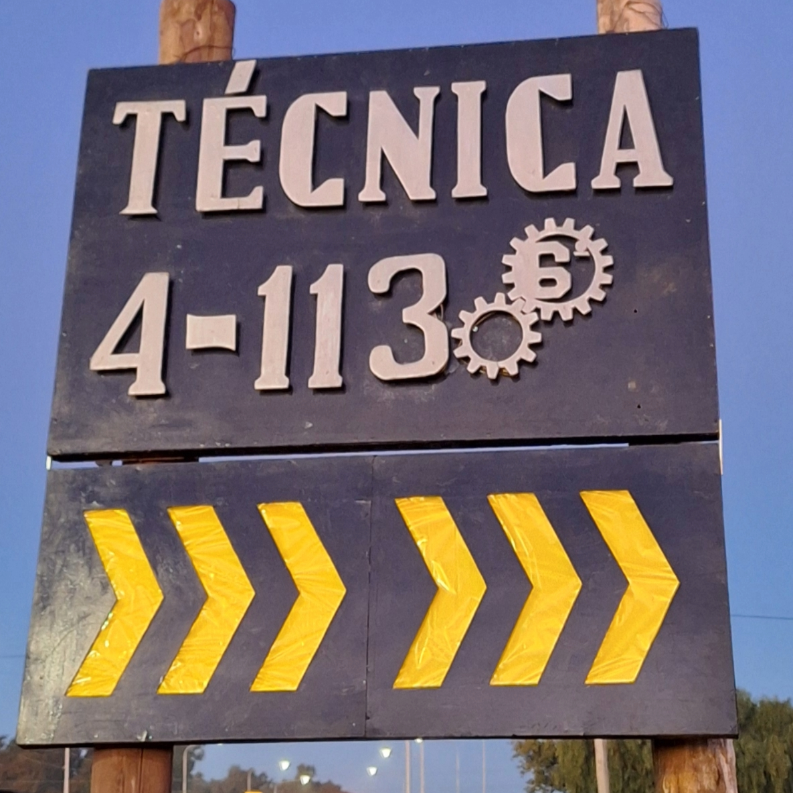
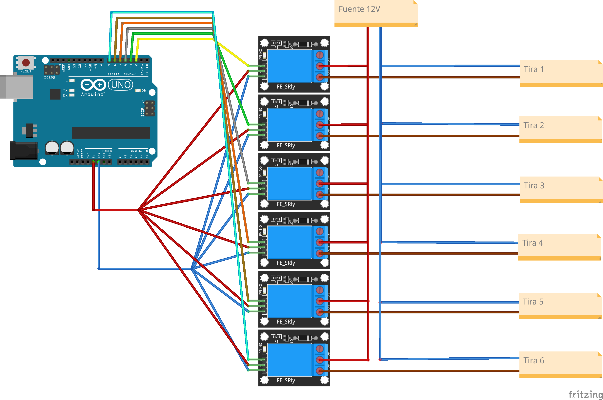

# Proyecto de desarrollo de cartel luminoso para la Esc. N.° 4-113 «Ing. Jorge R. Barraquero»

## Intención
El cartel fue usado en un evento en el que se representaba a la institución.

Con la publicación de este proyecto por este medio, se trata de dejar registro de la forma de armado y la programación usada para que futuros egresados lo puedan rearmar de ser requerido.

## Armado
- Armar el circuito electrónico según la siguiente imágen:

- Cargar el [código](./cartelito.ino) en el arduino.

- Alimentar el arduino por el conector USB o el jack y colocar la fuente de 12V dónde se indica para alimentar las tiras LED.

### Ante cualquier duda o consulta sobre el armado, contactar por mail: [facundolattandi@gmail.com](mailto:facundolattandi@gmail.com)